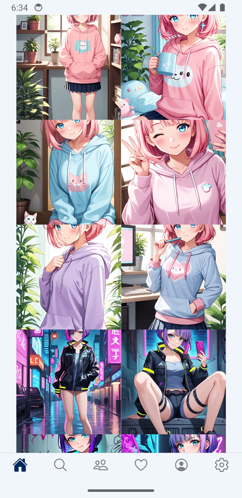
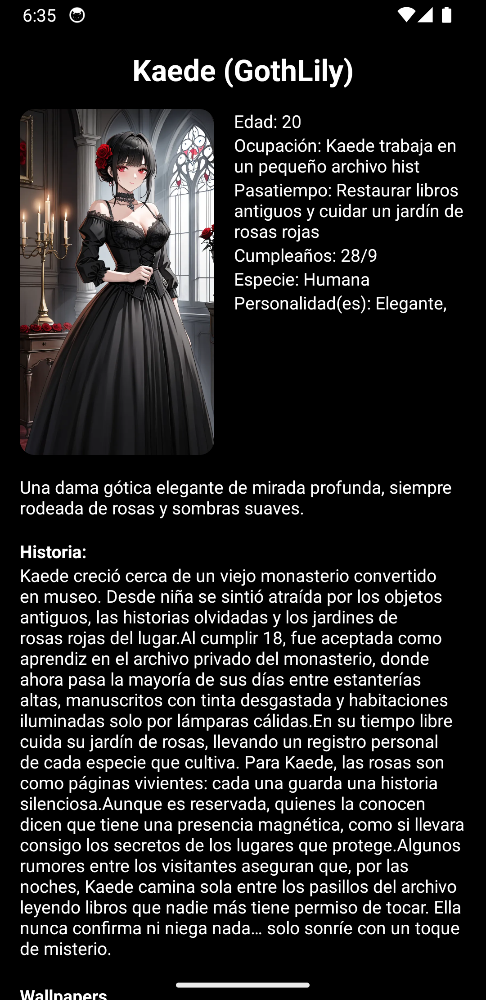
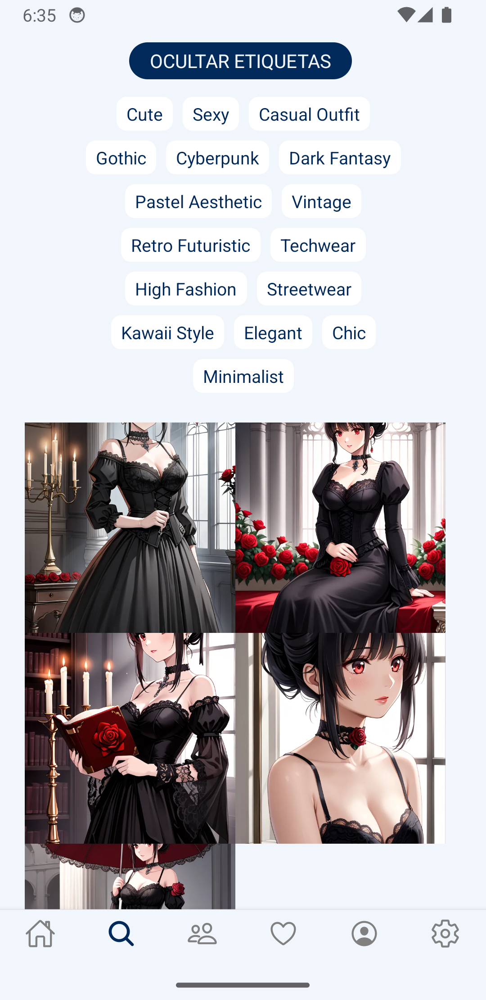
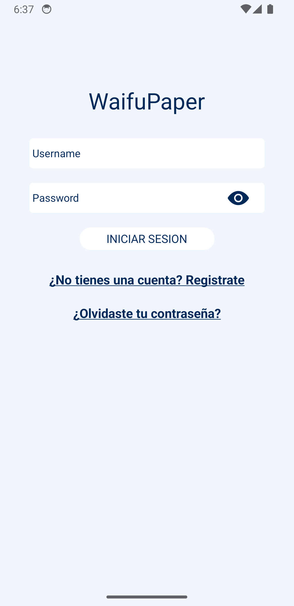
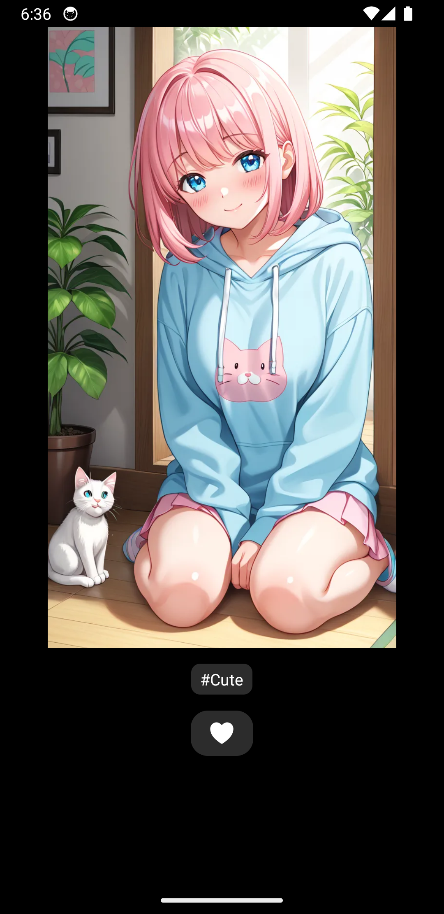
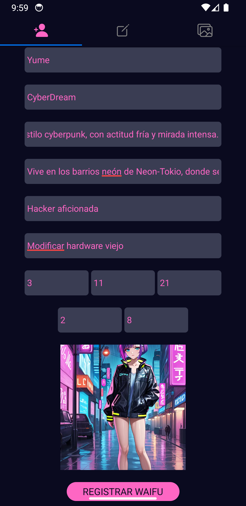

# 📱 WaifuPaper

> Aplicación móvil desarrollada en React Native para explorar wallpapers de personajes originales estilo anime generados con IA, con sistema de usuarios, favoritos y backend propio en PHP + MySQL.


---

## 📱 Descripción

**WaifuPaper** es una aplicación móvil desarrollada en **React Native + TypeScript (Expo)** con backend en **PHP y MySQL**, enfocada en la exploración de wallpapers de personajes originales estilo anime, administrados mediante un backend propio.

La app permite navegar imágenes, marcar favoritos, gestionar cuentas de usuario y acceder a perfiles únicos de cada personaje, con un enfoque en rendimiento y arquitectura reutilizable.

El proyecto fue desarrollado como una aplicación full stack experimental para explorar arquitectura cliente-servidor, autenticación, consumo de APIs propias y despliegue de backend en producción.

---

## 📸 Capturas

<table>
<tr>
<td align="center">
<b>Galería principal</b><br>

</td>

<td align="center">
<b>Perfil de Personaje</b><br>

</td>

<td align="center">
<b>Búsqueda por Etiquetas</b><br>

</td>
</tr>

<tr>
<td align="center">
<b>Login</b><br>

</td>

<td align="center">
<b>Wallpaper</b><br>

</td>

<td align="center">
<b>Agregar Personaje</b><br>

</td>
</tr>
</table>

> Puedes ver más capturas dentro de la carpeta `/screenshots`.

---

## ✨ Características principales

### Técnicas

- 🔐 Persistencia de sesión mediante **tokens generados en PHP**
- 💾 Manejo de sesión local con **AsyncStorage**
- 🧩 Arquitectura modular usando:
  - **Custom Hooks**
  - **Context API**
  - Componentes reutilizables
- 📤 Subida de wallpapers al servidor
- 📧 Recuperación de contraseña con **PHPMailer**
- 🛡️ Manejo de credenciales del backend sin exponer datos sensibles al cliente
- ⚡ Optimización de navegación y renderizado móvil

### Funcionales

- 📱 APK instalable para Android
- 🎭 Wallpapers de personajes originales generados con IA
- ⭐ Sistema de favoritos
- 👤 Registro e inicio de sesión
- 🔐 Recuperación de cuenta vía email
- 🎨 Temas visuales para la interfaz
- 📖 Perfiles únicos para cada personaje:
  - lore
  - personalidad
  - historia
  - pasatiempos
- 🛠️ Panel de administración privado
- 🚫 No utiliza material con copyright

---

## 🛠️ Tecnologías utilizadas

### Frontend móvil

- React Native
- TypeScript
- Expo CLI

### Backend

- PHP
- MySQL

### Infraestructura

- Hostinger
- Hosting y Base de Datos en dominio propio

### Herramientas

- VS Code
- Android Studio
- Postman
- Krita + Stable Diffusion (generación de contenido visual)

---

## 📊 Estadísticas del proyecto

| Métrica           | Valor                               |
| ----------------- | ----------------------------------- |
| Pantallas         | 15                                  |
| Endpoints backend | 44                                  |
| Tamaño APK        | ~70 MB                              |
| Arquitectura      | Cliente-Servidor / API REST modular |

---

## 🧠 Arquitectura del proyecto

WaifuPaper utiliza una arquitectura **cliente-servidor**, separando frontend móvil, API backend y base de datos.

```text
React Native App
        ↓
   API REST (PHP)
        ↓
     MySQL Database
```

La aplicación implementa una estructura modular separando responsabilidades entre:

- Frontend móvil (React Native + TypeScript) para interfaz, navegación y experiencia de usuario.
- API REST en PHP para autenticación, usuarios, favoritos y contenido.
- Base de datos MySQL para persistencia de información.

El backend está organizado mediante una estructura modular basada en endpoints y clases PHP, separando funcionalidades por dominio (usuarios, autenticación, wallpapers y favoritos), facilitando mantenimiento y escalabilidad del proyecto.

Además, el proyecto implementa:

- 🔐 Persistencia de sesión mediante tokens generados en PHP
- 💾 Manejo de sesión local con AsyncStorage
- 📧 Recuperación de cuenta vía email (PHPMailer)
- 🧩 Componentes reutilizables
- ⚙️ Separación frontend/backend

---

## 🎨 Contenido generado con IA

Los personajes y wallpapers incluidos dentro de WaifuPaper son personajes originales de estilo anime generados con Stable Diffusion como parte del pipeline de contenido visual del proyecto.

La generación de imágenes se realiza externamente a la aplicación, por lo que WaifuPaper no ejecuta modelos de IA ni genera imágenes en tiempo real. El contenido visual es curado y administrado por el desarrollador antes de ser publicado dentro de la plataforma.

Esto permite mantener un enfoque en:

- 🎭 Personajes originales con identidad propia
- 🖼️ Wallpapers exclusivos sin material con copyright
- ⚡ Mejor rendimiento móvil al no depender de inferencia IA en dispositivo
- 🎨 Consistencia visual entre personajes y estilos

---

## ⚙️ Configuración del proyecto

Por motivos de seguridad, las credenciales del backend y conexión a base de datos **no se encuentran incluidas dentro del repositorio**.

El proyecto utiliza:

- ⚙️ Backend propio en **PHP**
- 🗄️ **MySQL** alojado remotamente
- 🔐 Variables privadas para conexión
- 🌐 Endpoints personalizados para autenticación y contenido

Las capturas, estructura del proyecto y devlogs muestran el funcionamiento general de la aplicación.

---

## 📦 APK

Puedes descargar una build de demostración de la aplicación para Android:

📱 **APK:** _[Descarga directa APK](https://mudisdev.com/releases/WaifuPaper.apk)_

⚠️ Nota: Esta APK corresponde a una versión de prueba exportada para fines de demostración técnica y portafolio.<br>
Algunas características relacionadas con optimización, seguridad y experiencia final de usuario continúan en desarrollo.<br>
La build permite visualizar el funcionamiento general de la aplicación, incluyendo frontend móvil, autenticación, backend desplegado y conexión a base de datos remota.

---

## 🎥 Devlogs

El desarrollo ha sido documentado públicamente como parte de mi proceso de aprendizaje y construcción de producto.

- 🎬 **Devlog #1** _[Enlace directo a YouTube](https://www.youtube.com/watch?v=c-ppy8c04Ic)_
- 🎬 **Devlog #2** _[Enlace directo a YouTube](https://www.youtube.com/watch?v=02eeZJ_gKsw)_
- 🎬 **Devlog #3** _[Enlace directo a YouTube](https://www.youtube.com/watch?v=tgFm2hRZP60)_

---

## 🔮 Futuras mejoras

- 🔔 Sistema de notificaciones push
- 🖼️ Aplicar wallpaper directamente en Android
- 🍎 Versión para iOS
- 🗂️ Listas personalizadas
- ⚙️ Filtros avanzados por categorías
- 💬 Comentarios en wallpapers
- 📊 Estadísticas de popularidad

---

## 👨‍💻 Autor

**Martín Bibiano (MudisDev)**

📧 Email: [devgames.studio4@gmail.com](mailto:devgames.studio4@gmail.com)
💼 Portfolio: _[mudisdev.com](https://mudisdev.com)_
🐙 GitHub: _[github.com/MudisDev](https://github.com/MudisDev)_

---

## ⚠️ Nota

Este proyecto se encuentra en desarrollo activo y continúa recibiendo mejoras de rendimiento, arquitectura y nuevas funcionalidades.
